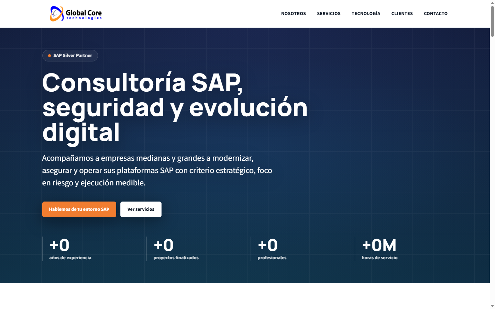

# Global Core Technologies — Landing Page

Corporate landing page for Global Core Technologies (SAP Silver Partner), built with Nuxt 4, Vue 3, TypeScript and Tailwind CSS. Multi-page architecture with static prerendering, high interactivity and zero new npm dependencies.

## Goals

- Multi-page architecture with dedicated service detail pages.
- SEO-first: JSON-LD structured data, canonical URLs per route, dynamic sitemap.
- Static generation-ready prerendering for all routes.
- Accessible, responsive and performance-focused UI.
- Modern SAP, security, cloud and AI positioning.
- High interactivity via native browser APIs only (no external animation libraries).

## Commands

Use Node `^22.12.0`, `^24.11.0` or `>=26.0.0` for Nuxt 4.4.x.

```bash
corepack enable
pnpm install
pnpm dev
pnpm test
pnpm build
pnpm generate
```

## Docker

```bash
docker compose up --build
```

The container serves the production Nuxt build at `http://localhost:3010`.

## Screenshots

### Home — Hero



## Routes

| Route | Description |
|-------|-------------|
| `/` | Home — hero, about, servicios, soluciones SAP, portfolio SAP, diferenciadores, industrias, tecnología, clientes, testimonios, CTA |
| `/servicios` | Listado de los 8 servicios SAP |
| `/servicios/[slug]` | Detalle de cada servicio (8 rutas prerenderizadas) |
| `/contacto` | Formulario de contacto con validación client-side |
| `/sitemap.xml` | Sitemap dinámico generado desde los datos |

## Project Structure

```
pages/
  index.vue                   # Home
  servicios/
    index.vue                 # Listado de servicios
    [slug].vue                # Detalle de servicio (8 slugs)
  contacto.vue                # Formulario de contacto

components/
  sections/
    HeroSection.vue           # Gradient mesh animado + contadores
    AboutSection.vue          # Tabs accesibles (ARIA)
    ServicesSection.vue       # Cards con iconos SVG inline
    SapSolutionsSection.vue   # Glassmorphism dark
    SapProductsSection.vue    # Cloud ERP, Cloud ERP Private, Business One
    DifferentiatorsSection.vue # Contadores animados
    IndustriesSection.vue     # Cards por industria
    TechnologySection.vue     # Pilares tecnológicos
    ClientsSection.vue        # Grid de logos
    TestimonialsSection.vue   # 3 cards con staggered reveal
    ContactCtaSection.vue     # CTA final
  ui/
    BaseButton.vue            # Dual-mode: NuxtLink o <a>
    AnimatedCounter.vue       # IntersectionObserver + useCountUp
    ServiceIcon.vue           # 8 iconos SVG inline
    TabPanel.vue              # Tabs accesibles con teclado
    TestimonialCard.vue       # Cita con quote decorativa
    ContactForm.vue           # Form con validación y aria-*
    SectionHeading.vue        # Heading con prop dark
    FeatureCard.vue           # Card de servicio
  AppHeader.vue               # Nav con NuxtLink + close on route change
  AppFooter.vue               # 4 columnas dark + social SVGs

composables/
  useCountUp.ts               # Contador animado (rAF + ease-out cúbico)
  useParallax.ts              # Parallax (passive scroll + rAF)

data/
  landing.ts                  # Servicios, diferenciadores, industrias, etc.
  sap-solutions.ts            # 3 soluciones SAP (S/4HANA, Impl, Seguridad)
  sap-products.ts             # Cloud ERP, Cloud ERP Private, Business One
  testimonials.ts             # 3 testimonios placeholder
  about-tabs.ts               # 4 tabs: Nosotros, Misión, Visión, Equipo
  navigation.ts               # Links de navegación
  site.ts                     # Config del sitio + Organization JSON-LD

tests/                        # Vitest test suite
docs/screenshots/             # Capturas de pantalla del sitio
```

## SEO

- Static prerender para todas las rutas (`/`, `/servicios`, 8x `/servicios/[slug]`, `/contacto`).
- `useSeoMeta()` único por página con title, description, og:* y twitter:*.
- Canonical URL por ruta.
- JSON-LD `Organization` global + `Service` y `BreadcrumbList` en páginas de servicio.
- Dynamic `sitemap.xml` generado desde el array de servicios.
- `robots.txt` servido desde `/public`.
- Semantic headings, landmarks y skip-link.

## Accessibility

- Skip link a `#main-content`.
- Tabs con roles ARIA (`tablist`, `tab`, `tabpanel`), `aria-selected`, `aria-controls` y keyboard nav (ArrowLeft/ArrowRight).
- Form con `aria-invalid`, `aria-describedby` linking a mensajes de error, `role="alert"` en errores y `role="status"` en éxito.
- `prefers-reduced-motion`: animaciones y parallax respetados.
- Focus-visible global con outline naranja.

## Interactivity (sin dependencias externas)

| Feature | Implementación |
|---------|---------------|
| Scroll reveal | `v-reveal` directive + IntersectionObserver |
| Contadores animados | `useCountUp` + requestAnimationFrame |
| Parallax sutil | `useParallax` + passive scroll listener |
| Hero mesh animado | CSS `@keyframes` puro |
| Tabs accesibles | Vue 3 reactivity + ARIA |
| Transiciones de página | Nuxt `pageTransition` + CSS opacity/translateY |
