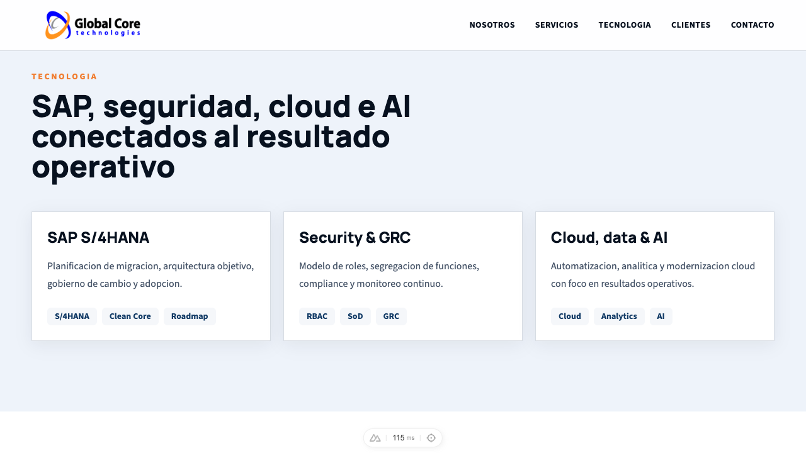

# Global Core Technologies Landing Page

Corporate landing page for Global Core Technologies, built with Nuxt 4, Vue 3, TypeScript and Tailwind CSS.

## Goals

- SEO-first corporate presence.
- Static generation-ready rendering.
- Accessible, responsive and performance-focused UI.
- Modern SAP, security, cloud and AI positioning.
- AI-First documentation with SDD and ADRs.

## Commands

Use Node `^22.12.0`, `^24.11.0` or `>=26.0.0` for Nuxt 4.4.x.

```bash
corepack enable
pnpm install
pnpm dev
pnpm test
pnpm build
pnpm generate
```

## Docker

```bash
docker compose up --build
```

The container serves the production Nuxt build at `http://localhost:3010`.

## Screenshots

### Hero


### Technology section



## Project Structure

- `docs/sdd/wip/corporate-landing-page/spec.md`: active SDD.
- `docs/architecture/adr/`: architecture decisions.
- `data/`: editable site and landing content.
- `components/sections/`: landing sections.
- `components/ui/`: reusable components.
- `tests/`: Vitest test suite.

## SEO Checklist

- Static prerender configured for `/`.
- Title and meta description.
- Open Graph and Twitter Cards.
- Canonical URL placeholder.
- `robots.txt`.
- Dynamic `sitemap.xml`.
- JSON-LD Organization schema.
- Semantic headings and landmarks.

## Visual Notes

The current iteration keeps the SAP/tech corporate identity with a lighter overall surface, stronger content hierarchy, scroll-reveal transitions, and a hero image carousel to showcase completed work.
